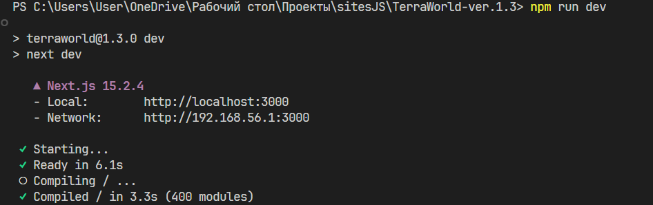

# Правила по установке

### 1) Установка node.js
В командной строке PowerShell от администратора введите эти команды в строку:

```
winget install Schniz.fnm
# Download and install Node.js:
fnm install 22
# Verify the Node.js version:
node -v # Should print "v22.14.0".
# Verify npm version:
npm -v
```
если все прошло успешно то приступите к пункту 2

### 2) Запуск сайта

Откройте проект в любой удобным вам IDE (в моем случае VS Code). После чего введите команду в строку:

```
npm run dev
```
Если все было сделано верно, следующее что вы увидете в консоли:



После запуска сайта, перейдите по ссылке:

```
https://localhost:3000
```
И наслаждайтесь сайтом!
